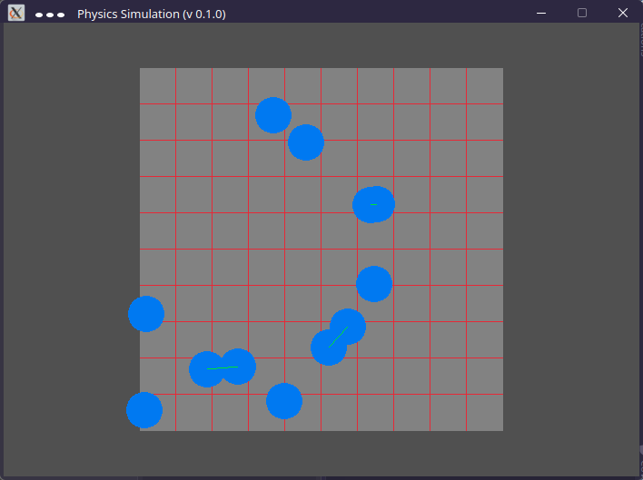

# PhysicSim

## Description:

PhysicSim is meant to be a simple simulation for object collision. 
The project just has started so there is no real reason to clone the project at the current state.
The goal is to simulate the collision of circles (balls) following the rules of gravity.

## Next steps:

* Move colliding objects apart in the opposite direction
* Applying gravity
* Creating borders

## Current state:

The first steps have been successfully accomplished:
* Creating a grid which helps to efficiently check for collisions
* Spawning randomly located objects
* Detecting collisions (objects which collide are connected by a green line)

## Used libraries:

The project uses <a href="https://www.raylib.com/"> raylib </a> which 
automatically gets installed using the CMakeLists.txt configuration file.  
The library itself depends on OpenGL. All needed dependencies (for OpenGL) can be installed using:
> sudo apt install libx11-dev libxrandr-dev libxinerama-dev libxcursor-dev libxi-dev libglew-dev